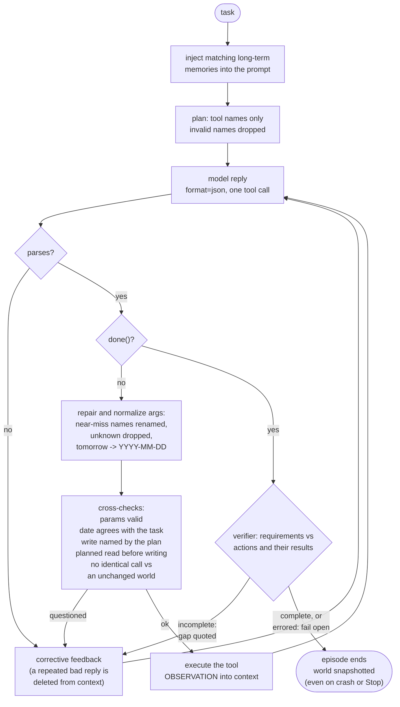

# Agent Lab

A private AI assistant that runs entirely on your own computer. It reads and
writes your mail, calendar, files, decks and spreadsheets, and nothing you type
or open ever leaves the machine.

## Get it running

1. **Install [Ollama](https://ollama.com/download)** — this is what runs the
   model locally. Nothing else needs to be installed by hand.
2. **Start Agent Lab.** Double-click `Agent Lab.command` on macOS, or
   `Agent Lab.ps1` on Windows. The first launch installs the Python packages
   and opens the app in its own window.
3. **Follow the setup screen.** It checks the four things a run needs — the
   packages, Ollama, the Ollama server, and the model — and offers to fix each
   one it can, including downloading the model with a progress bar.

That is the whole install. If you would rather do it yourself:

```bash
python3 -m pip install -r requirements.txt
cd standalone && python3 -m webui.app
```

The app binds to loopback only, so it is reachable from this computer and
nowhere else.

**Requires** Python 3.9+ and roughly 6 GB of disk for an 8B model. It runs on
CPU, so expect tens of seconds per step rather than an instant answer.

---

# Agent 8B — `llama3.1:8b`

The reference agent. Same code, same tools, same harness as the other four
folders; only `config.json` differs.

```json
{ "name": "Agent 8B", "model": "llama3.1:8b", "num_ctx": 8192 }
```

Everything is on-device. Inference goes to the local Ollama server at
`127.0.0.1:11434` (weights under `C:\Users\Lab User\SAIL\ollama`); the runner
asserts the endpoint is loopback and refuses anything else. All state stays in
this folder. Nothing leaves the machine.

```powershell
cd agents\8b
.\run.ps1 "Find a free hour on Thursday and book it as Deep work"
```

---

## 1. How the system is put together

The model is not the agent. The model is one component inside a loop that
supplies the structure, the checking, and the memory.

```
run.ps1
  └─ run_agent.py            this folder: config, flags, state paths, banner
       ├─ harness/llm.py         Ollama client (temp 0, seed 42, usage counters)
       │   or model_router.py    tiered variant, one model resident (--tiers)
       ├─ harness/world.py       simulated office: inbox, calendar, messages,
       │                         reminders — persisted to workspace/state.json
       ├─ harness/office.py      REAL .pptx / .xlsx writing (python-pptx, openpyxl)
       ├─ harness/fs_tools.py    REAL file tools, opt-in via --root
       ├─ harness/memory.py      long-term memory (JSONL + keyword retrieval)
       ├─ harness/tools.py       the tool registry + validation
       └─ harness/agent.py       run_harness(): the loop described below
```

`run_agent.py` in this folder is byte-identical to `agents/_shared/run_agent.py`
and to the copy in every other size folder. It:

1. reads `config.json`, asserts the Ollama URL is local,
2. parses flags, decides the LLM call budget (the model's profile decides the
   simulated default - 20 for this 8B - and `--root` raises it to 40),
3. opens `workspace/` as a **persistent** world and `memory/memory.jsonl`,
4. builds either a plain `LLM` or a tiered `ModelRouter`,
5. calls `run_harness(llm, world, mem, task)`,
6. prints what happened and writes `logs/run_NNN.json`.

Determinism: `temperature=0`, `seed=42`, `num_ctx` from config. Two runs of the
same task against the same state produce the same trajectory.

---

## 2. The loop, step by step

`run_harness()` in [`harness/agent.py`](../../harness/agent.py). One tool call
per model reply, JSON only.



Every box above is paid out of the same call budget as the work itself, and
every arrow into *corrective feedback* is a question, not a block: a call the
model repeats after being questioned is allowed to run.

**Setup.** Relevant long-term memories are retrieved (`mem.search(task, k=3)`,
keyword overlap, matches only — never a recency fallback) and injected into the
system prompt. The prompt carries the response shape, the rules, and the full
tool docs *with a worked example per tool*.

**Plan.** One call asks for a tool-grounded plan: `{"steps":[{"tool":...,
"what":...}]}`. Every step naming a tool that does not exist is dropped, and
the plan re-enters the context as short numbered guidance. The plan *request*
is popped from the context so the model never sees its own planning prose again.
Free-form prose is never allowed to become an instruction the model then obeys.

**Act.** Then, until `done` is accepted or the budget runs out:

| stage | what happens |
|---|---|
| decode | `format=json` — grammar-constrained, so the reply is JSON or nothing |
| parse | strict `json.loads`; on failure, fence-strip → brace-match → trailing-comma repair |
| repair | near-miss parameter names renamed onto missing required ones (`difflib`, cutoff 0.5); unknown parameters dropped; top-level args lifted into `args` |
| normalize | `date` → `YYYY-MM-DD` ("tomorrow", "next tuesday", "Jul 23", "7/23" all resolve against the clock); `time`/`start_time`/`end_time` → 24h `HH:MM` ("2pm" → `14:00`) |
| validate | missing/unknown parameters caught **before** execution; feedback quotes the tool's correct example |
| dedupe | an identical call may repeat up to a per-profile budget while the world is unchanged; a call that FAILED gets no repeat budget, since rerunning it reproduces the error |
| cross-check | a well-formed date the model wrote itself is compared against the date the task names ("Wednesday" cannot become a Monday unnoticed); a write the model's own plan never proposed, or a write before the planned read, is questioned once and allowed on insistence |
| execute | tool runs; result truncated to 2000 chars and fed back as `OBSERVATION:` |

**Finish.** When the model calls `done`, a **verifier** call re-reads the task
against the log of actions actually taken - with each action's RESULT, so it
can see that the file it is about to demand already exists - and answers
`{"complete": bool, "missing": str}`. If incomplete, `done` is rejected, the
gap is quoted back, and the loop continues. Up to two verify rounds. On any
verifier error it defaults to `complete: true` rather than trapping the agent.

**Repetition handling.** Models fall into loops, and a repeated exchange sitting
in the context is itself the attractor pulling them back. So the harness does
two things: it refuses to re-execute the duplicate, and it *deletes the older
copy of the exchange from the message list* before restating the task. Two
`think` calls in a row also earn a "stop thinking and act" nudge.

**Budget honesty.** Plan, verify and every repair round are paid out of the same
`MAX_CALLS` counter as ordinary tool calls. The scaffolding does not get free
turns.

---

## 3. The tools

Simulated-office mode (the default) exposes 16 tools from
[`harness/tools.py`](../../harness/tools.py):

`list_emails` · `read_email` · `send_email` · `list_events` · `add_event` ·
`update_event` · `cancel_event` · `send_message` · `set_reminder` ·
`create_presentation` · `create_spreadsheet` · `read_spreadsheet` · `think` ·
`save_memory` · `recall_memories` · `done`

`create_presentation` and `create_spreadsheet` write **real** files — open the
`.pptx` / `.xlsx` in `workspace/files/` in PowerPoint or Excel. A cell string
beginning with `=` becomes a live formula.

The simulated clock is fixed at **Monday, 2026-07-20** so date reasoning is
reproducible. In `--root` mode the harness is switched to the real system date
instead.

---

## 4. State that survives between runs

| path | contents |
|---|---|
| `workspace/state.json` | inbox, calendar, sent mail, chat messages, reminders — seeded with demo fixtures on first run, then evolves |
| `workspace/files/` | the real `.pptx` / `.xlsx` the agent produced |
| `memory/memory.jsonl` | long-term memory; say "remember that ..." and later runs get it injected automatically |
| `logs/run_NNN.json` | full transcript: system prompt, plan, every model reply, repairs, observations, verdicts |
| `logs/model_calls.jsonl` | per-call tier/token/latency records (`--tiers` only) |

This folder is the one with history — `memory/memory.jsonl` already holds a
fact from an earlier session:

```json
{"fact": "Dana owns the auth fix, Priya is waiting on it, Sam owns the billing webhook blocker."}
```

Any task whose wording overlaps those keywords gets it injected into the system
prompt automatically, without the model having to call `recall_memories`. That
is the whole learning loop: `save_memory` in one episode, keyword-matched
injection in the next.

Delete `workspace/state.json` and `memory/memory.jsonl` to factory-reset this
agent.

---

## 5. Real-computer mode

`--root` swaps the fake office for real files under one folder, Codex /
Claude-Code style:

```powershell
.\run.ps1 --root "C:\Users\Lab User\Desktop\sandbox" "Tidy these notes into folders"
.\run.ps1 --root . --shell "What changed in this project today?"
```

Tools added: `list_dir`, `read_file`, `write_file`, `append_file`,
`delete_path`, `move_path`, `search_files`, and with `--shell`, `run_command`.
The simulated office tools are dropped in this mode — a fake inbox is a known
distraction — leaving the file tools plus `think`, `save_memory`,
`recall_memories`, `done`.

Guardrails in [`harness/fs_tools.py`](../../harness/fs_tools.py): every path is
resolved against the root and must stay inside it (`..\`, absolute paths and
`%VAR%` expansion are all blocked after resolution); a deny-list keeps
`Windows\`, `Program Files\`, the Python interpreter, the Ollama model blobs and
this project's `results\` and `harness\` unwritable even if the root is a drive
root; overwrite, delete, move and shell each prompt for y/n confirmation, and a
declined action comes back as an error telling the model not to retry it.
`--yolo` turns the prompts off.

8B is the smallest size where a real-folder task usually goes through cleanly on
the first attempt. It still gets the sandbox, not the Desktop.

---

## 6. Model tiers

`--tiers` routes calls through
[`harness/model_router.py`](../../harness/model_router.py). Each call carries a
role — `driver` (chooses the next tool), `router` (planning), `verifier` (the
pre-`done` check) — and the default lineup points all three at this folder's
model, so **exactly one model stays resident in RAM**. A `deep` tier is declared
(`keep_alive: "0"`, evicted immediately after use) but nothing invokes it
automatically. Per-tier token and latency totals print at the end and append to
`logs/model_calls.jsonl`.

Note that `llama3.1:8b` is the router's own hard-coded default base in
`default_roles()` — this folder is the configuration the tier system was written
around.

```powershell
.\run.ps1 --tiers "Summarise the README and write a one-line TODO file"
.\run.ps1 --tiers --small llama3.2:3b "..."   # 3B plans and verifies; 2 models resident
.\run.ps1 --tiers --deep qwen2.5:32b "..."    # heavier on-demand tier
```

`--small llama3.2:3b` is the most useful variant here: planning and verification
are short, structured calls that a 3B handles well, so the 8B spends its time
driving. The cost is a second model resident in RAM.

Each role can name a LoRA `adapter`. Ollama's HTTP API cannot hot-swap a LoRA
per request, so today roles specialise by prompt only; the `adapter` field is
the seam where a `llama-server` backend plus trained GGUF adapters plugs in.

---

## 7. Flags

| flag | effect |
|---|---|
| `--root PATH` | enable real-file tools, scoped to PATH |
| `--shell` | also allow `run_command` (PowerShell), still confirmed |
| `--yolo` | skip confirmation prompts |
| `--tiers` | route model calls through the tiered router |
| `--small TAG` | cheaper model for routing/verify (implies `--tiers`) |
| `--deep TAG` | on-demand heavy tier (implies `--tiers`) |
| `--with-office` | keep the simulated office tools alongside the file tools |
| `--max-calls N` | LLM call budget (default: the profile's, 50 at 8B; at least 40 for real files or real mail) |

---

## 8. What to expect at 8B

Tens of seconds per step on CPU — usable, not interactive. A 4-step task is a
couple of minutes. Budget accordingly before starting something with `--root`
and a 40-call ceiling.

This is the size where the harness stops rescuing the model and starts merely
tidying up after it. Format repair and loop-breaking fire rarely; what still
earns its place is the verifier (8B will call `done` with the last clause of a
three-part task unaddressed) and the plan step (it keeps tool order sensible on
tasks that need to read before they write).

Multi-step office tasks — read an email, extract the numbers, build the deck,
reply — are within reach here and are roughly where the ceiling sits for
anything you want done unattended.
